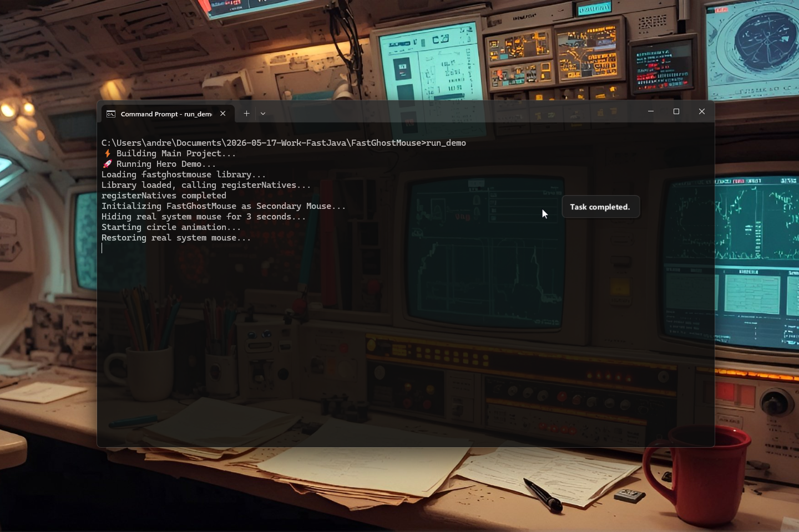

# FastGhostMouse v0.1.0 [ALPHA] — High-Performance Native Overlay Cursor for Java

[](https://github.com/andrestubbe/FastGhostMouse/releases/tag/v0.1.0)
[](https://opensource.org/licenses/MIT)
[](https://www.java.com)
[]()
[](https://jitpack.io/#andrestubbe)

**⚡ A lightweight, click-through native overlay module for the FastJava ecosystem. Visualize cursor paths and AI
predictions with zero latency.**

**FastGhostMouse** provides a high-performance, transparent native overlay for visual feedback. Built for bot
visualization, UI debugging, and AI-driven cursor path prediction.

[](https://www.youtube.com/watch?v=BZsqQl7WqWk)

---
## Table of Contents

- [Quick Start](#quick-start)
- [Features](#features)
- [Quick Start](#quick-start)
- [Installation](#installation)
- [License](#license)

---

## Quick Start

```java
import fastghostmouse.FastGhostMouse;

public class Example {
    public static void main(String[] args) {
        // TODO
    }
}
```

---


## Features

- **🖱️ Ghost Cursor**: Hardware-accelerated, click-through overlay cursor.
- **✨ Smooth Paths**: Native DirectX rendering for flicker-free path visualization.
- **📦 Zero Latency**: Bypasses the Java Swing/AWT event thread.
- **🚀 Click-Through**: Completely focus-agnostic native window.

## Quick Start

```bash
# Clone the repository
git clone https://github.com/andrestubbe/FastGhostMouse.git

# Build the native bridge
cd FastGhostMouse
.\compile.bat

# Launch the OverlayDemo
.\run-demo.bat
```

## Installation

### Option 1: Maven (Recommended)

Add the JitPack repository and the dependencies to your `pom.xml`:

```xml

<repositories>
    <repository>
        <id>jitpack.io</id>
        <url>https://jitpack.io</url>
    </repository>
</repositories>

<dependencies>
<!-- FastGhostMouse Library -->
<dependency>
    <groupId>com.github.andrestubbe</groupId>
    <artifactId>fastghostmouse</artifactId>
    <version>v0.1.0</version>
</dependency>

<!-- FastCore (Required Native Loader) -->
<dependency>
    <groupId>com.github.andrestubbe</groupId>
    <artifactId>fastcore</artifactId>
    <version>v0.1.0</version>
</dependency>
</dependencies>
```

### Option 2: Gradle (via JitPack)

```groovy
repositories {
    maven { url 'https://jitpack.io' }
}

dependencies {
    implementation 'com.github.andrestubbe:fastghostmouse:v0.1.0'
    implementation 'com.github.andrestubbe:fastcore:v0.1.0'
}
```

### Option 3: Direct Download (No Build Tool)

Download the latest JARs directly to add them to your classpath:

1. 📦 *
   *[fastghostmouse-v0.1.0.jar](https://github.com/andrestubbe/FastGhostMouse/releases/download/v0.1.0/fastghostmouse-v0.1.0.jar)
   ** (The Core Library)
2. ⚙️ **[fastcore-v0.1.0.jar](https://github.com/andrestubbe/FastCore/releases/download/v0.1.0/fastcore-v0.1.0.jar)** (
   The Mandatory Native Loader)

> [!IMPORTANT]
> All JARs must be in your classpath for the native JNI calls to function correctly.

---

## License

MIT License — See [LICENSE](LICENSE) file for details.

---

## Related Projects

- [FastFileIndex](https://github.com/andrestubbe/FastFileIndex) — Ultra-fast filesystem scanner
- [FastTheme](https://github.com/andrestubbe/FastTheme) — High-performance native window styling
- [FastThumb](https://github.com/andrestubbe/FastThumb) — Native Shell Image Engine

---

**Part of the FastJava Ecosystem** — *Making the JVM faster. Small package. Maximum speed. Zero bloat. 🚀📋*


